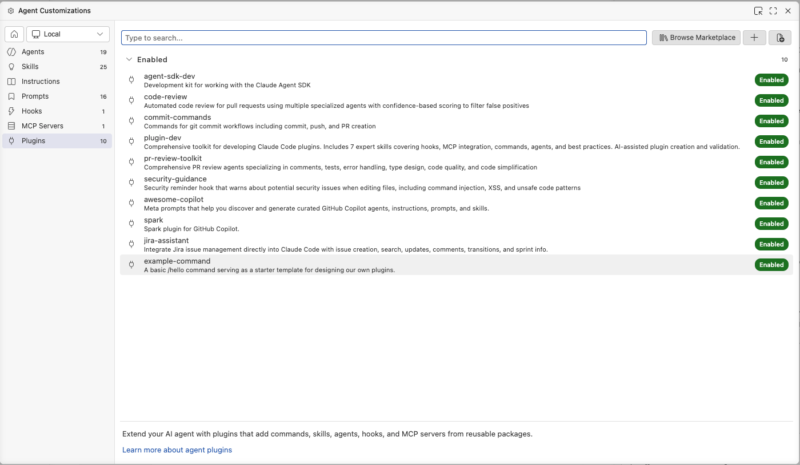
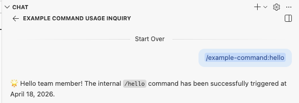

# Internal Plugin Repository (`plugin-internal`)

This repository serves as a centralized, standalone Marketplace for Claude Code. It is designed to host and manage internal team plugins, specialized agents, and custom workflows.

## 1. Directory Structure

The repository maintains the following structure:

```text
plugin-internal/
├── .claude-plugin/
│   └── marketplace.json      # Central registry defining all available plugins
├── plugins/
│   └── example-command/      # Reference plugin implementation
└── README.md                 # Repository documentation
```

## 2. Installation via Visual Studio Code

These plugins can be installed and managed directly within the Visual Studio Code interface without utilizing the command-line interface. Note: Ensure this repository is pushed to a remote Git host (e.g., GitHub, GitLab) prior to installation.

**Method 1: Install via the Command Palette**
1. Launch Visual Studio Code and open the Command Palette (`Ctrl+Shift+P` or `Cmd+Shift+P` on macOS).
2. Execute the **`Chat: Install Plugin From Source`** command.
3. Provide the remote Git repository URL (e.g., `https://github.com/your-org/plugin-internal`). Visual Studio Code will automatically clone and register the plugin.

**Method 2: Install via the Chat Customizations Editor**
1. Open the GitHub Copilot / Chat view in Visual Studio Code.
2. Select the **Gear icon** (Settings) located in the Chat view, then navigate to **Plugins**.
3. Within the Chat Customizations editor, click the **`+` (Add)** button on the Plugins page.
4. Input the remote Git repository URL.

**Managing Plugins:**
Upon installation, plugins can be enabled, disabled, or uninstalled via the **Agent Plugins - Installed** section in the Visual Studio Code Extensions panel, or directly through the Chat view settings. Custom commands (such as the reference `/hello`) will be immediately integrated into the Copilot Agent environment.

**Installed**





## 3. Creating New Plugins (`plugin-dev`)

New plugins should be scaffolded using the `plugin-dev` toolkit provided in the primary `claude-code` repository to ensure structural consistency.

1. Navigate to your source directory and initialize the CLI:
   ```bash
   claude
   ```
2. Execute the interactive plugin creation workflow:
   ```bash
   /plugin-dev:create-plugin
   ```
3. Follow the systematic prompts provided by the system to define your plugin's functionality, structure, and required metadata.
4. Upon successful generation (typically created in a local `plugins/` directory), transfer the newly scaffolded directory into this repository's `plugin-internal/plugins/` directory.
5. Finalize the integration by registering the new plugin within `plugin-internal/.claude-plugin/marketplace.json`. Append the configuration schema to the `"plugins"` array:
   ```json
   {
      "name": "plugin-identifier",
      "description": "Functional description of the plugin...",
      "source": "./plugins/plugin-identifier",
      "category": "development",
      "version": "1.0.0"
   }
   ```
   
Subsequent updates to `marketplace.json` will distribute the new capabilities to downstream users upon synchronization.
